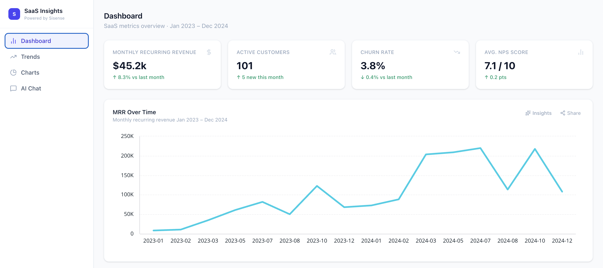
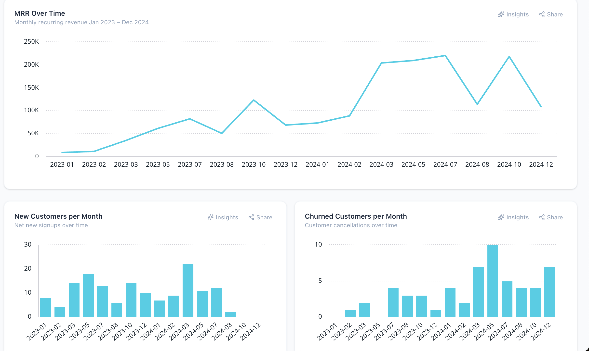
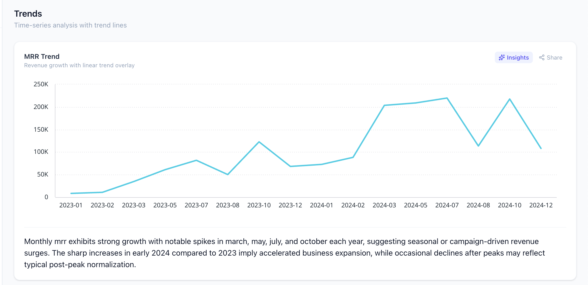
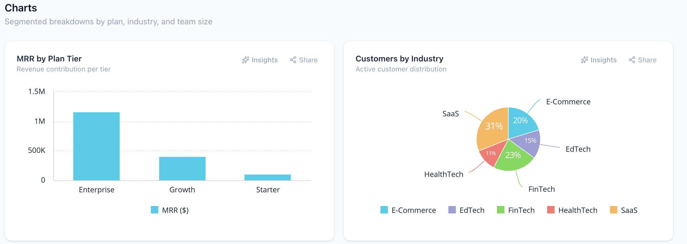
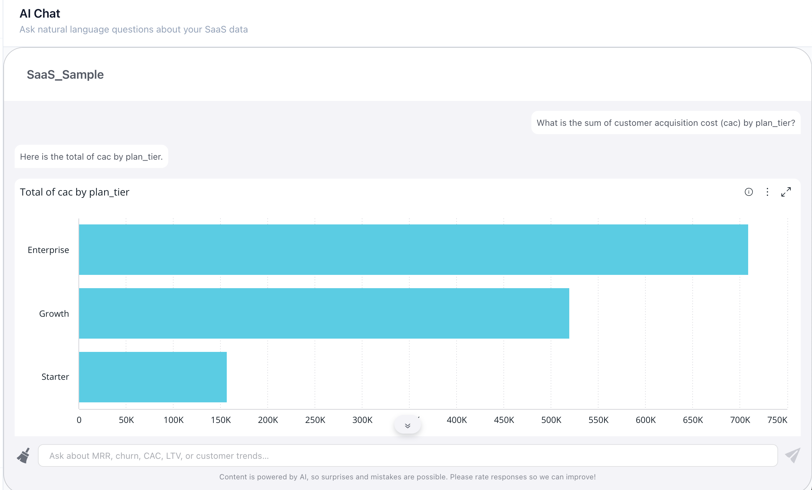
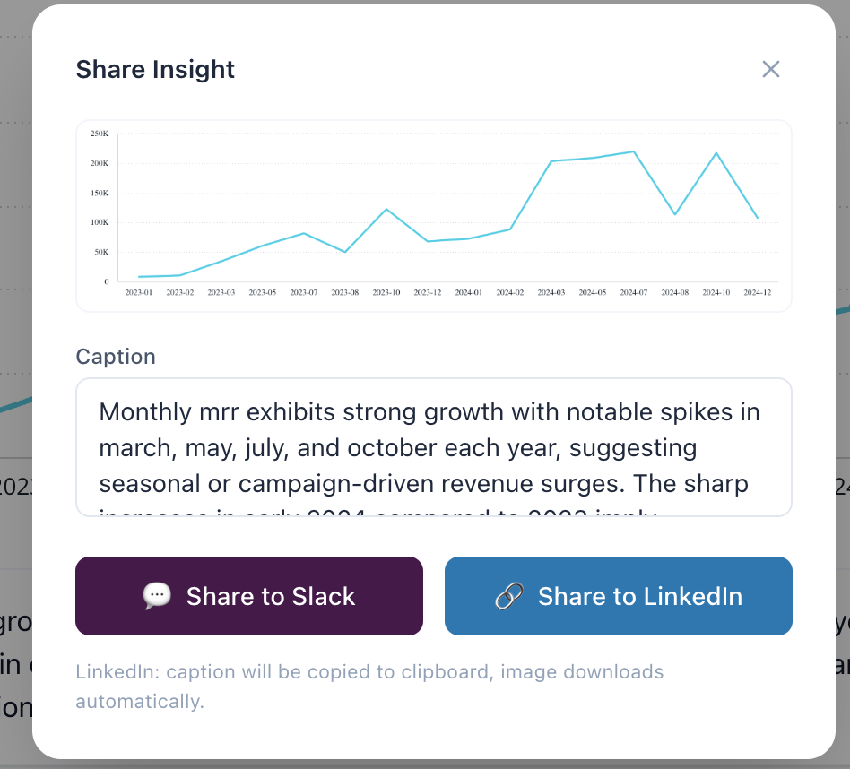
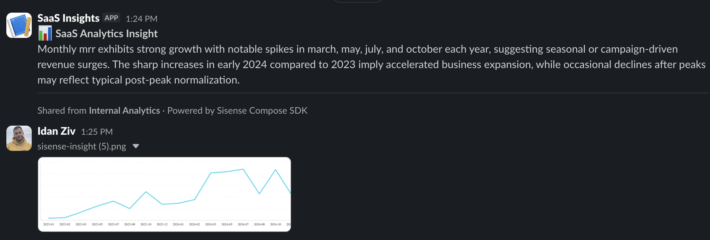

# How I Built My Team an Internal Analytics Tool in a Day — Saving Time and Money With Sisense and Vibe-Coding

**Target publications:** Medium (`Better Programming`, `The Startup`) · r/SaaS · r/indiehackers · r/webdev
**Reading time:** ~8 min

---

My team's metrics lived in five places: MRR in Stripe, churn in a spreadsheet, NPS in a Google Form nobody opened, CAC on a sticky note. Every Monday I lost 45 minutes pulling tabs before I could answer a single real question.

I gave myself one day to ship something working — using the **Sisense Compose SDK** as the analytics engine and Claude as my vibe-coding co-pilot. The SDK ships with more than I expected: embedded charts, an AI chatbot, per-chart NLG insights, and a built-in sharing component that pushes any chart to Slack or LinkedIn in two clicks. By end of day I had a real tool I handed to my team.

This post walks through the build: setup, prompts, screenshots, and references.



---

## The Stack

- **Next.js 16 + React 19 + TypeScript** — a real app, not a prototype
- **Sisense Compose SDK** (`@sisense/sdk-ui` + `@sisense/sdk-data`) — embedded charts, the AI chatbot (NLQ/NLG), NLG insights per chart, and the built-in sharing component
- **Claude Code** — my vibe-coding co-pilot for the entire build
- **Slack Incoming Webhook** — the destination for shared insights (LinkedIn works out of the box, no extra setup)

Lines of code I wrote by hand: maybe 50. Claude wrote the rest. That's the point.

---

## Setup (10 minutes)

**1. Get your Sisense trial.** Sign up at [sisense.com](https://sisense.com). You'll get an instance URL and a personal API token from the user menu.

**2. Generate the sample data:**

```bash
node scripts/generate-data.mjs
```

That writes `src/data/saas-metrics.csv` — 2,031 rows covering 150 customers over 24 months.

**3. Upload the CSV to Sisense** as an ElastiCube via Sisense Studio. Wait for the build (~20 min) and note the data source name it assigns.

**4. Configure `.env.local`:**

```bash
NEXT_PUBLIC_SISENSE_URL=https://your-trial.sisense.com
NEXT_PUBLIC_SISENSE_TOKEN=your_api_token
SLACK_WEBHOOK_URL=https://hooks.slack.com/services/...
```

**5. Update `DATA_SOURCE_NAME`** in `src/lib/saas-schema.ts` to match the Sisense name.

**6. Run it:**

```bash
npm install && npm run dev
```

Open `localhost:3000` and the dashboard loads with your live data.

---

## The Build, Prompt by Prompt

The whole app came from a handful of focused prompts to Claude. Here are the ones that did the most work.

### Prompt 1 — Generate realistic sample data

> *"Write a Node.js script that generates a CSV called saas-metrics.csv with 150 SaaS customers over 24 months. Each row is a customer-month. Include: customer_id, company_name, industry (SaaS/E-Commerce/FinTech/HealthTech/EdTech weighted), team_size_bucket, plan_tier (Starter 60% / Growth 30% / Enterprise 10%), mrr (Starter $49–199, Growth $299–999, Enterprise $2k–8k), cac, ltv, nps_score, is_active, is_new, is_churned. Customers churn probabilistically per tier (5% / 3% / 1.5%), MRR has ±3% monthly jitter, is_new is only true in the signup month."*

Output: a 60-line script that ran in 30 seconds and produced data realistic enough to make every chart interesting.

### Prompt 2 — Wire up the Sisense providers and a reusable ChartCard

> *"I'm using the Sisense Compose SDK in Next.js 16. Set up the SisenseContextProvider and AiContextProvider in a client component (the SDK uses browser globals, so providers must run client-side). Then create a ChartCard wrapper that takes a title, subtitle, optional shareCaption, optional insights config, and children. The card should expose the SDK's Share button in its header."*

This is where the tool clicked. Claude wired the providers, set up a CORS proxy via `next.config.ts`, and built the `ChartCard` wrapper every tab uses. From there, adding a chart is a five-line component.

### Prompt 3 — Add the Sisense Chatbot for natural-language questions

> *"Add a Chatbot tab that uses the Sisense Chatbot component from `@sisense/sdk-ui/ai`. Configure it against my data source so I can ask things like 'Which industry had the highest MRR last quarter?' and have it answer in plain English."*

Output: a single component with the Chatbot bound to the data source. NLQ + NLG working end-to-end, no SQL.

### Prompt 4 — Add the SDK's per-chart NLG insights toggle

> *"Each ChartCard should have an optional 'Insights' toggle button. When toggled on, render the SDK's GetNlgInsights panel below the chart with the same data source, dimensions, and measures the chart uses."*

With one toggle, you get an AI-generated paragraph explaining what the chart shows — and that text becomes the default caption when you share it.

---

## The Four Tabs

### Dashboard — "What happened this week?"

KPI cards for MRR, active customers, churn rate, NPS — plus the MRR-over-time chart and column charts for new and churned customers per month. The Monday morning sanity check.



The Sisense `<Chart />` component is the part that still surprises me:

```tsx
<Chart
  dataSet={DataSource}
  chartType="line"
  dataOptions={{
    category: [DM.Date.Months],
    value: [measureFactory.sum(DM.Mrr, "Total MRR ($)")],
    breakBy: [],
  }}
/>
```

No D3. No manual axis logic. No fetching boilerplate. The SDK handles the query, rendering, tooltips, and legend.

### Trends — "Where are we going?"

Line and area charts for MRR growth, customer count, and NPS over the full 24 months.



### Charts — "Where should I focus?"

Segmented breakdowns: MRR by plan tier, customers by industry (pie), CAC vs LTV by tier, NPS by segment, customers by team size. The kind of slices that answer "where do I invest next?".



### AI Chat — "What does this mean?"

The Sisense `Chatbot` component wired to the data source. Ask *"Which industry had the highest LTV in 2024?"* and it queries the data and answers in plain English.



---

## Sharing: Two Clicks From a Chart to Your Team's Slack

This is the feature my team uses the most.

Every chart card in the app has a Share button — one of the SDK's most useful built-in features. The flow is:

1. Open a chart
2. Click ✦ **Insights** → the SDK generates a natural-language summary of what the chart shows
3. Click **Share** → a modal opens with the chart screenshot and the AI-generated text already pre-filled as your caption
4. Pick **Slack** → the message goes to your channel, the chart image downloads locally so you can attach it
5. Or pick **LinkedIn** → the image downloads, the LinkedIn share dialog opens with your caption ready to paste



Two clicks from a chart you're looking at to a Slack thread your whole team is reading.



The Slack destination is just a webhook URL in `.env.local`. LinkedIn works out of the box because it uses LinkedIn's share dialog, no OAuth.

---

## Time and Money Saved

Concrete numbers from my team after a week of using this:

- **Manual reporting cycle before**: ~45 minutes per person per week — pulling Stripe data, building a chart, writing a summary, sharing it
- **With this tool**: ~3 minutes — open the dashboard, click Insights, click Share
- **At a 6-person team**: that's **3+ hours/week recovered**, roughly a 65% drop in reporting overhead

Tooling cost: zero on the Sisense trial, zero on Slack webhooks, zero on LinkedIn. The cost is one engineer's day. The tool paid for itself in the first week.

---

## References

- **Sisense Compose SDK Guide** — [sisense.dev/guides/compose-sdk](https://sisense.dev/guides/compose-sdk/)
- **Sisense Trial** — [sisense.com](https://sisense.com)
- **This project on GitHub** — [github.com/your-handle/sisense-internal-bi-tool](https://github.com/your-handle/sisense-internal-bi-tool)

---

## Try It

Clone the repo, plug in your trial credentials, upload the CSV, and run `npm run dev`. You'll have a working internal analytics tool on `localhost:3000` in about 30 minutes — and you can share your first insight to your team's Slack the same afternoon.

If you build something with this, drop a comment. I'd genuinely like to see what you make.

---

*Built with Sisense Compose SDK + Claude Code in ~7 hours.*
